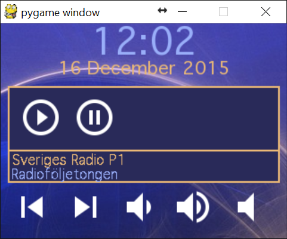
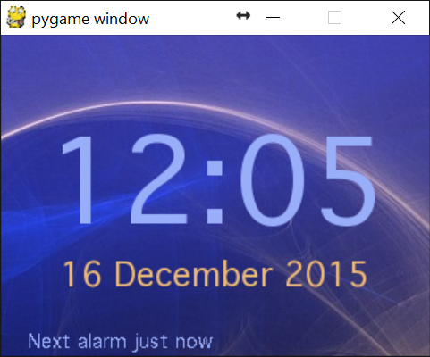

# DigitalNightstand

Digital Nightstand for the Tingbot/Raspberry Pi.

Features includes:

* Internet Radio, 
* Digital Clock
* Alarm Clock
* Web Frontend

See <DigitalNightstand.tingapp/> for more information.

## Screenshots ##

**Radio Page**:  

**Clock Page**:  

